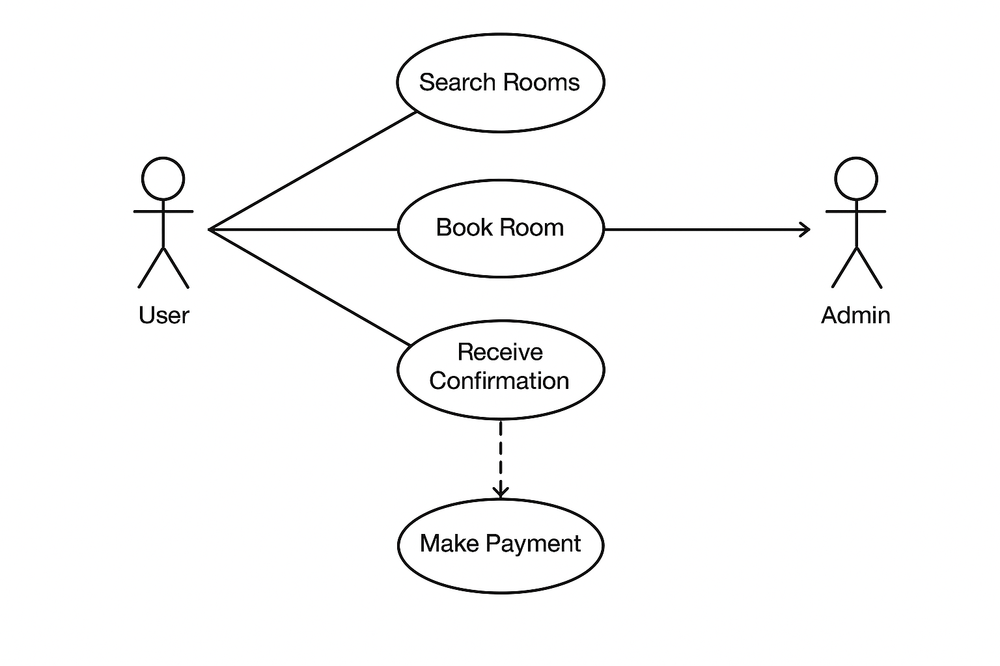

# Requirement Analysis in Software Development.

## Introduction

This repository explains the concept and importance of Requirement Analysis in the **Software Development Life Cycle (SDLC)**.
It is designed as part of a project to illustrate how software requirements are gathered, analyzed, documented, and validated before system design and implementation.

## What is Requirement Analysis?

Requirement Analysis is the process of understanding, documenting, and managing the needs and expectations of stakeholders for a software system.
It ensures that developers build what the customer truly needs rather than what they think they need.

It plays a crucial role in the SDLC, bridging the gap between stakeholders (clients, users) and the development team.
During this phase, requirements are gathered, analyzed for feasibility, modeled, and documented in detail.

### Key Benefits:

- Helps avoid costly changes later in development.
- Improves communication between clients and developers.
- Serves as a foundation for design, testing, and validation.

## Why is Requirement Analysis Important?

Requirement Analysis is critical in the SDLC for the following reasons:

1. Clarity and Understanding
It ensures all stakeholders have a shared understanding of system goals, preventing miscommunication.

2. Project Scope Management
It defines what is in and out of the project scope, avoiding scope creep and wasted effort.

3. Improved Quality and Cost Efficiency
Identifying requirements early reduces defects, rework, and project costs.

## Key Activities in Requirement Analysis

The main activities involved in Requirement Analysis are:

- Requirement Gathering:
  Collecting initial inputs from stakeholders through interviews, surveys, and observation.

- Requirement Elicitation:
  Engaging with stakeholders to explore hidden or implicit requirements.

- Requirement Documentation:
  Recording requirements in clear, structured formats such as SRS (Software Requirements Specification).

- Requirement Analysis and Modeling:
  Evaluating, prioritizing, and visualizing requirements using models like use case diagrams or data flow diagrams.

- Requirement Validation:
  Confirming that documented requirements align with stakeholder needs and project goals.

## Types of Requirements
1. Functional Requirements

    Functional requirements define what the system should do—the specific behaviors, functions, and features.

    Examples (for Booking Management System):

    - Users can search for available rooms by date and location.
    
    - Users can book a room and receive a confirmation email.
    
    - Admins can add, edit, or remove listings.
    
    - The system should process online payments securely.

2. Non-functional Requirements

    Non-functional requirements specify how the system performs rather than what it does.
  
    Examples:

    - The system should handle up to 10,000 concurrent users.
    
    - The booking confirmation email must be sent within 10 seconds of payment.
    
    - The website must be available 99.9% of the time.
    
    - The interface should be mobile-friendly and accessible.

## Use Case Diagrams

Use Case Diagrams are visual tools used to represent system interactions between actors (users or external systems) and use cases (functionalities).
They help clarify system boundaries and stakeholder roles.

Benefits:

- Simplifies communication between business and technical teams.
- Helps identify missing or redundant functionality.
- Serves as a foundation for system design and test cases.
### Use Case Diagram for Booking System:

Actors:

- User (Customer)
- Admin
- Payment Gateway

Use Cases:

- Search Rooms
- Book Room
- Make Payment
- Receive Confirmation
- Manage Listings (Admin)

## Acceptance Criteria

Acceptance Criteria define the conditions that must be met for a feature to be considered complete and accepted by stakeholders.
They ensure clarity, consistency, and testability of requirements.

Importance:

- Helps developers understand when a feature is “done.”
- Enables testers to verify that functionality meets expectations.
- Provides measurable goals for each requirement.

Example (Checkout Feature – Booking System):

- User can view selected room details and total price before payment.
- System accepts valid payment methods (credit card, PayPal).
- Booking confirmation is displayed and emailed within 10 seconds.
- Transaction data is securely stored and logged.
